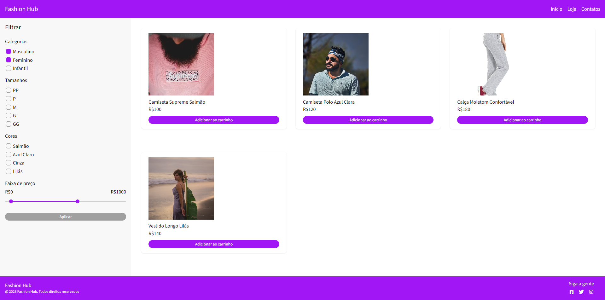

# Fashion Hub
- Loja de roupas (projeto em andamento)
- Telas:
    - Catálogo de produtos

# Principais tecnologias utilizadas:
  - React
  - Typescript
  - Node.js / Express
  - MySQL
  - Axios

# Como instalar
- Crie o arquivo .env

`touch env`

- Adicione as variáveis de ambiente de acordo com o arquivo example.env

- No MySQL, crie um Schema com o mesmo nome da variável que configurou em DB_NAME na .env
    - Crie uma Table com o nome "products" e as colunas "id, name, price, color, category, imgUrl"

- No diretório principal, execute os seguintes comandos em ordem:

`npm install concurrently`

`npm install`

- Para iniciar o projeto, execute:

`npm start`